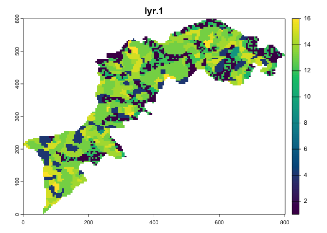
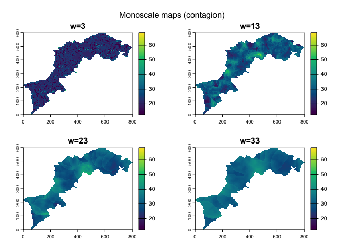
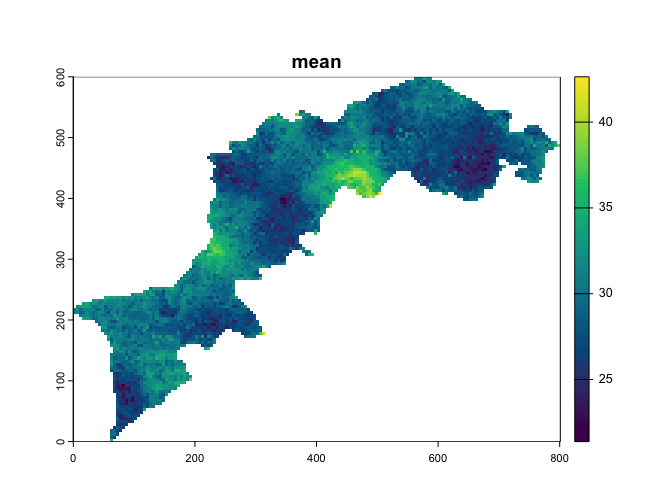
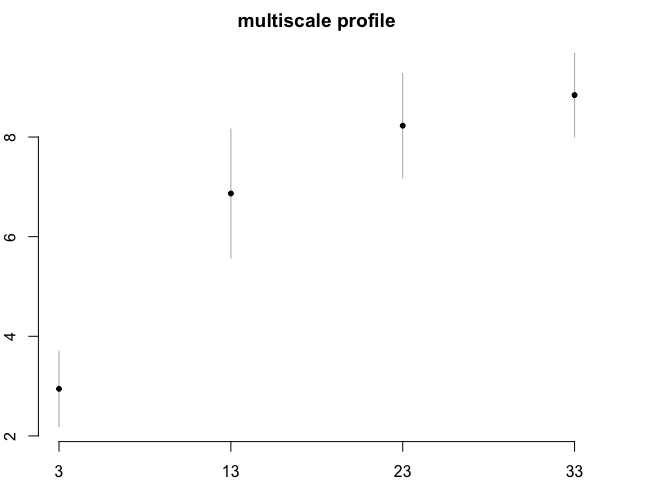
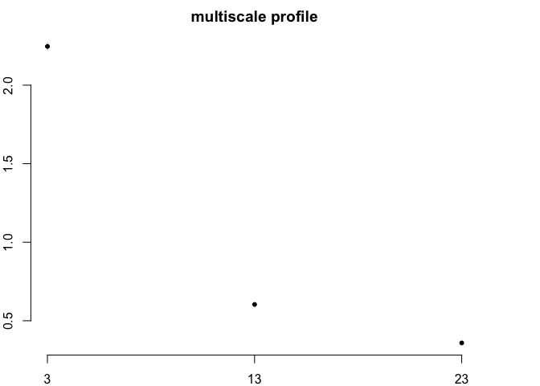

# mucha

<!-- badges: 
[-blue.svg)](https://cran.r-project.org/web/licenses/GPL (>= 3))
[](https://cran.r-project.org/package=mucha)
[](https://cran.r-project.org/web/checks/check_results_mucha.html)
[](https://cran.r-project.org/package=mucha)
[](https://lifecycle.r-lib.org/articles/stages.html#experimental)
&#10;end -->

## In brief

The primary goal of CMP package is to port the MHM and CMP softwares by
Gaucherel and colleagues to R. They were originally written in Java and
are no longer maintained (but see
[MHM](http://amap-dev.cirad.fr/projects/mhm) and
[CMP](http://amap-dev.cirad.fr/projects/cmp) legacy pages).

Both MHM and CMP approaches propose a methodology to capture the local
and scaling variations of landscapes, or anything that can be turned
into rasters.

MHM works on a single raster, while CMP works on a pair of rasters. Both
use moving windows and summary functions to end up with several rasters
(aka the monoscale maps) one per window size, that are eventually
combined, using a custom function to obtain a multiscale map, and
summarized using a profile plot.

A graphical user interface (in shiny) will probably be released soon, so
that people not proficient in R still could do some MHM and CMP
analyses, just as for original softwares.

## Installation

You can install the last release on CRAN with:

``` r
install.packages("mucha")
```

You can install the development version of mucha from
[GitHub](https://github.com/) with:

``` r
pak::pak("vbonhomme/mucha")
```

## MHM Example

Below, we will use an example raster on which we will apply an MHM
approach with default parameters (see \[MHM\]). Then we will plot all
successive layers and the aggregated version of them using an arithmetic
mean. Finally, we display a vanilla boxplot of the resulting profile
plot.

``` r
library(mucha)
library(terra)
#> terra 1.7.29

# load an example raster and downsize it
# to make things a little faster
l <- import_example("l1.tif") %>% raster_resample(0.2)

# chitchat
raster_summary(l)
#> >>> [160x120] raster (likely categorical)
#> >>> with following (9) classes: 1, 4, 9, 11, 12, 13, 14, 15, 16
#> >>> 13987 NA (72.8%) among 19200 values

# plot it -- you can also use terra::plot
p(l, title = "Kottoli landscape")
```



Now calculate contagion at three different scales. We use the cpp
version of contagion to speed up calculations.

    #>  ■■■■■■■■■■■■■■■■■■■■■■■ 75% | ETA: 1s 

Now let’s plot all monoscale maps:

``` r
p(l_mhm, multi_title = "Monoscale maps (contagion)")
```



Finally, we calculate and show a multiscale map and a profile plot:

``` r
app(l_mhm, mean) %>% p(multi_title = "Multiscale map (averaged contagion)")
```



``` r
ms_profile(l_mhm)
```



CMP works pretty much the same but with two landscapes.

``` r
# we import another one landscape
l2 <- import_example("l2.tif") %>% raster_resample(0.2)
# here we calculate an euclidean distance between the two
l12_cmp <- CMP(l, l2, fun=dist_euclidean_cppr)

# plots now
l12_cmp %>% p(multi_title = "Monoscale maps (euclidean distance)")  # monoscale maps
```


``` r
l12_cmp %>% app(mean) %>% p(multi_title = "Multiscale maps (averaged)") # multiscale map
```


``` r
l12_cmp %>% ms_profile() # profile plot
```



An html version of this vignette and of the doc lives
<https://vbonhomme.github.io/mucha/> Feel free to report bugs and
suggest features on the github repo <https://github.com/vbonhomme/mucha>
